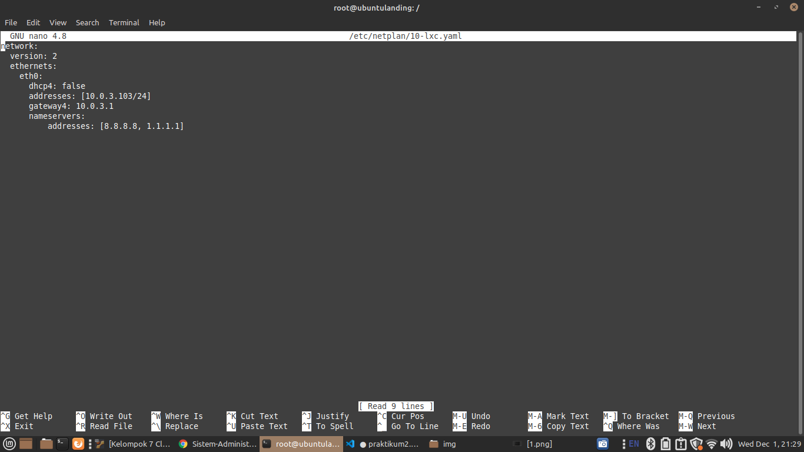
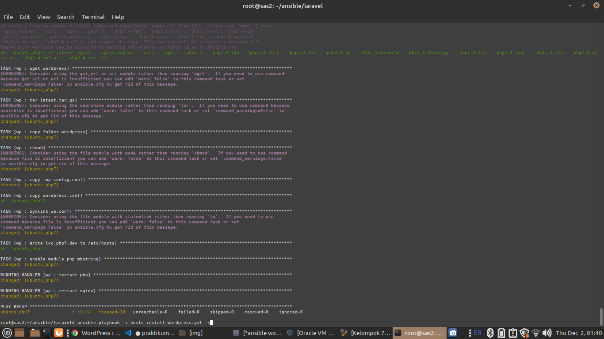
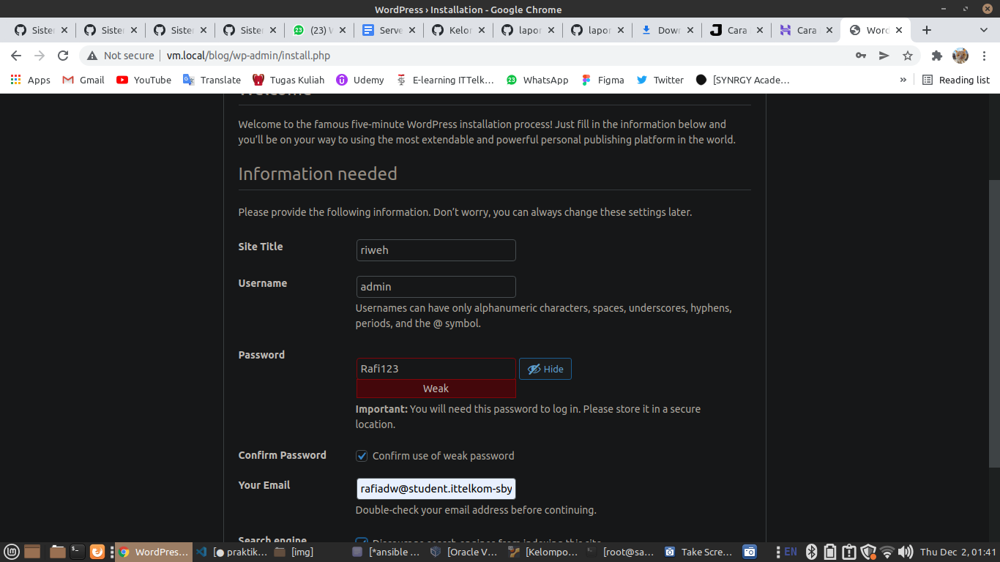
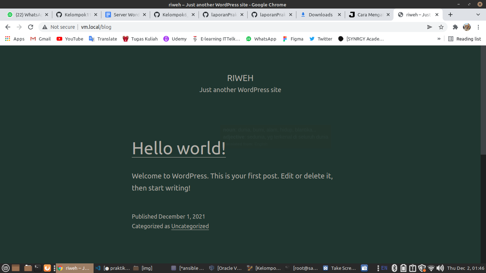

## Soal Modul 2

1. Rubah LXC landing dengan ubuntu focal (destroy n create, same ip, same name)
2. Rubah LXC php7 dengan ubuntu focal (destroy n create, same ip, same name)
3. vm.local/
   - akan diinstall menggunakan framework laravel 8 pada lxc_landing
   - laravel 8 menggunakan php7.4
   - tentunya harus bisa connect ke server database (lxc_mariadb)
   - semua script instalasi tidak ada yang manual (kecuali openssh-server), harus menggunakan ansible, termasuk membuat database (sungguh mereka jumawa sekali)
4. vm.local/blog
   - install wordpress terbaru pada lxc_php7.4
   - wordpress menggunakan php7.4
   - tentunya harus bisa connect ke server database (lxc_mariadb)
   - semua script instalasi tidak ada yang manual (kecuali openssh-server), harus menggunakan ansible, termasuk membuat database (sungguh mereka jumawa sekali)
   - Bisa masuk dashboard

## Jawaban

1. Merubah versi ubuntu ubuntu_landing dan ubuntu_php7.4 ke focal

   ```bash
   sudo su
   lxc-stop -n ubuntu_landing
   lxc-destroy ubuntu_landing
   lxc-stop -n ubuntu_php7.4
   lxc-destroy ubuntu_php7.4

   lxc-create -n ubuntu_landing -t download -- --dist ubuntu --release focal --arch amd64 --force-cache --no-validate --server images.linuxcontainers.org
   lxc-create -n ubuntu_php7.4 -t download -- --dist ubuntu --release focal --arch amd64 --force-cache --no-validate --server images.linuxcontainers.org

   lxc-start -n ubuntu_landing
   lxc-start -n ubuntu_php7.4
   ```

2. Konfigurasi ip masing-masing container ke static dan konfigurasi ssh server

   - set ip static ubunutu_landing

   ```bash
   lxc-attach -n ubuntu_landing
   apt install nano net-tools curl
   nano /etc/netplan/10-lxc.yaml
   ```

   

   ```bash
   netplan apply
   ```

   - set ssh server ubuntu_landing

   ```bash
   apt install openssh-server
   nano /etc/ssh/sshd_config

   # setting config menjadi
   PermitRootLogin yes
   RSAAuthentication yes

   # end of config
   service sshd restart

   ```

   - set password ssh server

   ```bash
   passwd
   ```

   - set ip static ubuntu_php7.4

   ```bash
   lxc-attach -n ubuntu_landing
   apt install nano net-tools curl
   nano /etc/netplan/10-lxc.yaml
   ```

   

   ```bash
   netplan apply
   ```

   - set ssh server ubuntu_php7.4

   ```bash
   apt install openssh-server
   nano /etc/ssh/sshd_config

   # setting config menjadi
   PermitRootLogin yes
   RSAAuthentication yes

   # end of config
   service sshd restart

   ```

   - set password ssh server

   ```bash
   passwd
   ```

3. Installasi php dan laravel pada container ubuntu_landing menggunaan ansible
   ```bash
   vm.local/
   - buka directory ansible dan buat folder laravel

   ```bash
   cd ~/ansible/
   mkdir laravel
   cd laravel/
   nano install-laravel.yml
   ```

   - isi seperti berikut

   ```bash
   - hosts: ubuntu_landing
   vars:
    username: 'admin'
    password: 'SysAdminSas0102'
    domain: 'lxc_landing.dev'
   roles:
    - php
    - lv
   ```

   - buat folder task dan handlers pada roles untuk php

   ```bash
   mkdir -p roles/php/tasks
   mkdir -p roles/php/handlers
   ```

   - buat file main.yml pada roles task

   ```bash
   nano roles/php/tasks/main.yml
   ```

   - isinya seperti berikut

   ```bash
   ---
    - name: delete apt chache
    become: yes
    become_user: root
    become_method: su
    command: rm -vf /var/lib/apt/lists/*

    - name: install php
    become: yes
    become_user: root
    become_method: su
    apt: name={{ item }} state=latest update_cache=true
    with_items:
        - curl
        - gtkhash
        - crack-md5
        - git
        - nginx
        - nginx-extras
        - php7.4
        - php7.4-fpm
        - php7.4-curl
        - php7.4-xml
        - php7.4-gd
        - php7.4-opcache
        - php7.4-mbstring

    - name: enable module php mbstring
    command: phpenmod mbstring
    notify:
        - restart php
   ```

   - buat file main.yml pada roles handlers

   ```bash
   nano roles/php/handlers/main.yml
   ```

   - isinya seperti berikut

   ```bash
   ---
    - name: restart php
    become: yes
    become_user: root
    become_method: su
    action: service name=php7.4-fpm state=restarted
   ```

   - buat folder task dan handlers pada roles untuk laravel

   ```bash
   mkdir -p roles/lv/tasks
   mkdir -p roles/lv/templates
   mkdir -p roles/lv/handlers
   ```

   - buat file main.yml pada roles task

   ```bash
   nano roles/lv/tasks/main.yml
   ```

   - isinya seperti berikut

   ```bash
   ---
    - name: delete apt chache
    become: yes
    become_user: root
    become_method: su
    command: rm -vf /var/lib/apt/lists/*

    - name: install composer
    shell: curl -sS https://getcomposer.org/installer | php
    args:
        chdir: /usr/src/
        creates: /usr/local/bin/composer
        warn: false
    become: yes

    - name: making composer to global path
    copy:
        dest: /usr/local/bin/composer
        group: root
        mode: '775'
        owner: root
        src: /usr/src/composer.phar
        remote_src: yes
    become: yes

    - name: creating landing directory
      file:
        path: /var/www/html/landing
        state: absent

    - name: create laravel project
      shell: /usr/local/bin/composer create-project laravel/laravel /var/www/html/landing --prefer-dist --no-interaction

    - name: copying file .env.template
      template:
        src=templates/env.template
        dest=/var/www/html/landing/.env

    - name: composer
      shell: cd /var/www/html/landing; /usr/local/bin/composer install --no-interaction

    - name: key
    shell: /usr/bin/php7.4 /var/www/html/landing/artisan key:generate

    - name: chmod
    become: yes
    become_user: root
    become_method: su
    command: chmod 777 -R /var/www/html/landing/storage

    - name: copying lv.conf
    template:
        src=templates/lv.conf
        dest=/etc/nginx/sites-available/{{ domain }}
    vars:
        servername: '{{ domain }}'

    - name: symlink lv.conf to sited-enabled
      command: ln -sfn /etc/nginx/sites-available/{{ domain }} /etc/nginx/sites-enabled/{{ domain }}
      notify:
    - restart nginx

    - name: writing {{ domain }} to /etc/hosts
      lineinfile:
        dest: /etc/hosts
        regexp: '.*{{ domain }}'
        line: "127.0.0.1 {{ domain }}"
        state: present
   ```

   - buat file env.template pada roles templates

   ```bash
   nano roles/lv/templates/env.template
   ```

   - isinya seperti berikut

   ```bash
   server {
     listen 80;
     listen [::]:80;
     access_log /var/log/nginx/vhostlaravel-access.log;
     error_log /var/log/nginx/vhostlaravel-error.Log;
     root /var/www/html/landing/public;
     index index.php index.html index.html;
     server_name lxc_landing.dev;

     location / {
              try_files $uri $uri/ /index.php?$query_string;
     }
     location ~ \.php$ {
            try_files $uri =404;
            fastcgi_split_path_info ^C.+\.php)(/.+)$;
            fastcgi_pass unix:/run/php/php7.4-fpm.sock;
            fastcgi_index index.php;
            fastcgi_param SCRIPT_FILENAME $document_root$fastcgi_script_name;
            include fastcgi_params;
      }
    }
   ```

   - buat file main.yml pada roles handlers

   ```bash
   nano roles/lv/handlers/main.yml
   ```

   - isinya seperti berikut

   ```bahs
   ---
    - name: restart php
    become: yes
    become_user: root
    become_method: su
    action: service name=php7.4-fpm state=restarted

    - name: restart nginx
    become: yes
    become_user: root
    become_method: su
    action: service name=nginx state=restarted
   ```

4. wordpress

   - buka ansible/laravel

   ```bash
   cd ~/ansible/

   cd laravel
   nano install-wordpress.yml
   ```

   - berisi

   ```bash
   ---
   ```

- hosts: ubuntu_php7
  vars:
  username: 'admin'
  password: 'SysAdminSas0102' #DON'T FORGET TO CHANGE
  domain: 'lxc_php7.dev'
  roles:

  - wp

  ```

  - buat beberapa roles seperti handlers tasks dan templates
  ```

```bash
mkdir -p roles/wp/tasks
mkdir -p roles/wp/handlers
mkdir -p roles/wp/templates
```

- buat file main di roles wp task

```bash
nano roles/wp/tasks
```

- berisi

```bash
---
- name: delete apt chache
become: yes
become_user: root
become_method: su
command: rm -vf /var/lib/apt/lists/*

- name: install requirement
become: yes
become_user: root
become_method: su
apt: name={{ item }} state=latest update_cache=true
with_items:
 - nginx
 - nginx-extras
 - curl
 - wget
 - php7.4
 - php7.4-fpm
 - php7.4-curl
 - php7.4-xml
 - php7.4-gd
 - php7.4-opcache
 - php7.4-mbstring
 - php7.4-zip
 - php7.4-json
 - php7.4-cli
 - php7.4-mysqlnd
 - php7.4-xmlrpc
 - php7.4-curl

- name: wget wordpress
shell: wget -c http://wordpress.org/latest.tar.gz

- name: tar latest.tar.gz
shell: tar -xvzf latest.tar.gz

- name: copy folder wordpress
shell: cp -R wordpress /var/www/html/blog

- name: chmod
become: yes
become_user: root
become_method: su
command: chmod 775 -R /var/www/html/blog/

- name: copy .wp-config.conf
template:
 src=templates/wp.conf
 dest=/var/www/html/blog/wp-config.php

- name: copy wordpress.conf
template:
 src=templates/wordpress.conf
 dest=/etc/nginx/sites-available/{{ domain }}
vars:
 servername: '{{ domain }}'

- name: Symlink wordpress.conf
command: ln -sfn /etc/nginx/sites-available/{{ domain }} /etc/nginx/sites-enabled/{{ domain }}
notify:
 - restart nginx

- name: Write {{ domain }} to /etc/hosts
lineinfile:
 dest: /etc/hosts
 regexp: '.*{{ domain }}$'
 line: "127.0.0.1 {{ domain }}"
 state: present

- name: enable module php mbstring
command: phpenmod mbstring
notify:
 - restart php

```

- buat file main di wp handlers

```bash
nano roles/wp/handlers/main.yml
```

- berisi

```bash
---
- name: restart php
become: yes
become_user: root
become_method: su
action: service name=php7.4-fpm state=restarted

- name: restart nginx
become: yes
become_user: root
become_method: su
action: service name=nginx state=restarted
```

- buat file wp.conf di wp template

```bash
nano roles/wp/templates/wp.conf
```

- berisi

```bash

<?php
/**
 * The base configuration for WordPress
 *
 * The wp-config.php creation script uses this file during the installation.
 * You don't have to use the web site, you can copy this file to "wp-config.php"
 * and fill in the values.
 *
 * This file contains the following configurations:
 *
 * * MySQL settings
 * * Secret keys
 * * Database table prefix
 * * ABSPATH
 *
 * @link https://wordpress.org/support/article/editing-wp-config-php/
 *
 * @package WordPress
 */

define( 'WP_HOME', 'http://vm.local/blog' );
define( 'WP_SITEURL', 'http://vm.local/blog' );

// ** MySQL settings - You can get this info from your web host ** //
/** The name of the database for WordPress */
define( 'DB_NAME', 'blog' );

/** MySQL database username */
define( 'DB_USER', 'admin' );

/** MySQL database password */
define( 'DB_PASSWORD', 'SysAdmin0102' );

/** MySQL hostname */
define( 'DB_HOST', '10.0.3.200:3306' );

/** Database charset to use in creating database tables. */
define( 'DB_CHARSET', 'utf8' );

/** The database collate type. Don't change this if in doubt. */
define( 'DB_COLLATE', '' );

/**#@+
 * Authentication unique keys and salts.
 *
 * Change these to different unique phrases! You can generate these using
 * the {@link https://api.wordpress.org/secret-key/1.1/salt/ WordPress.org secret-key service}.
 *
 * You can change these at any point in time to invalidate all existing cookies.
 * This will force all users to have to log in again.
 *
 * @since 2.6.0
 */
define( 'AUTH_KEY',         'put your unique phrase here' );
define( 'SECURE_AUTH_KEY',  'put your unique phrase here' );
define( 'LOGGED_IN_KEY',    'put your unique phrase here' );
define( 'NONCE_KEY',        'put your unique phrase here' );
define( 'AUTH_SALT',        'put your unique phrase here' );
define( 'SECURE_AUTH_SALT', 'put your unique phrase here' );
define( 'LOGGED_IN_SALT',   'put your unique phrase here' );
define( 'NONCE_SALT',       'put your unique phrase here' );

/**#@-*/

/**
 * WordPress database table prefix.
 *
 * You can have multiple installations in one database if you give each
 * a unique prefix. Only numbers, letters, and underscores please!
 */
$table_prefix = 'wp_';

/**
 * For developers: WordPress debugging mode.
 *
 * Change this to true to enable the display of notices during development.
 * It is strongly recommended that plugin and theme developers use WP_DEBUG
 * in their development environments.
 *
 * For information on other constants that can be used for debugging,
 * visit the documentation.
 *
 * @link https://wordpress.org/support/article/debugging-in-wordpress/
 */
define( 'WP_DEBUG', false );

/* Add any custom values between this line and the "stop editing" line. */


/* That's all, stop editing! Happy publishing. */

/** Absolute path to the WordPress directory. */
if ( ! defined( 'ABSPATH' ) ) {
        define( 'ABSPATH', __DIR__ . '/' );
}

/** Sets up WordPress vars and included files. */
require_once ABSPATH . 'wp-settings.php';

```

- buat file wordpress.conf di wp template

```bash
nano roles/wp/templates/wordpress.conf
```

- berisi

```bash
server {
     listen 80;
     listen [::]:80;

     # Log files for Debugging
     access_log /var/log/nginx/wordpress-access.log;
     error_log /var/log/nginx/wordpress-error.log;

     # Webroot Directory for Laravel project
     root /var/www/html/blog;
     index index.php index.html index.htm;

     # Your Domain Name
     server_name lxc_php7.dev;

     location / {
             try_files $uri $uri/ /index.php?$query_string;
     }

     # PHP-FPM Configuration Nginx
     location ~ \.php$ {
             try_files $uri =404;
             fastcgi_split_path_info ^(.+\.php)(/.+)$;
             fastcgi_pass unix:/run/php/php7.4-fpm.sock;
             fastcgi_index index.php;
             fastcgi_param SCRIPT_FILENAME $document_root$fastcgi_script_name;
             include fastcgi_params;
     }
}
```

- lalu install dengan ansible

```bash
ansible-playbook -i hosts install-wordpress.yml -k
```



- hasil
  
  
